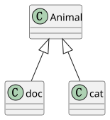
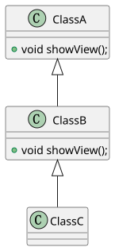
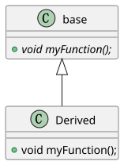
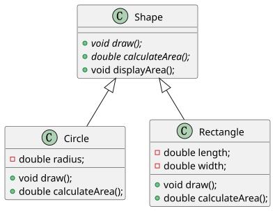

|   版本   |   日期    |   修改   |   修改者   |
|----------|----------|----------|-----------|
| 1.0.0 | 2023-12-21 | 初版 |zhengqingquan|
| 1.0.1 | 2023-12-22 | 新增类图、修改部分文本 |zhengqingquan|

- [类和对象](#类和对象)
  - [成员属性和成员方法。](#成员属性和成员方法)
- [面向对象编程](#面向对象编程)
  - [封装](#封装)
    - [public](#public)
    - [private](#private)
    - [protected](#protected)
  - [继承](#继承)
    - [继承链的执行顺序](#继承链的执行顺序)
  - [抽象](#抽象)
  - [多态](#多态)
  - [operator](#operator)
- [指针](#指针)
  - [\*和\&](#和)
  - [函数指针](#函数指针)
- [在C语言中的\_\_attribute\_\_](#在c语言中的__attribute__)
  - [__attribute__((packed))](#attributepacked)
  - [__attribute__((used))](#attributeused)
  - [__attribute__((weak))](#attributeweak)
- [回调函数](#回调函数)
- [面向切面编程](#面向切面编程)
  - [钩子函数](#钩子函数)
  - [面向切面编程](#面向切面编程-1)
- [GCC](#gcc)
- [信号量](#信号量)
  - [信号量的基本概念：](#信号量的基本概念)
  - [信号量的作用和应用：](#信号量的作用和应用)
  - [互斥锁](#互斥锁)

## 类和对象

在学习任何一门`面向对象语言`时，第一部分肯定都是介绍什么是类、什么是对象、以及类和对象之间的关系。

从下定义的角度来解释：

1. **面向对象（Object-Oriented，简称OO）**：是一种程序设计思想或范型，它将程序中的数据和操作数据的行为封装在一起，形成一个称为对象的整体单元。这种思想的基本概念包括类（Class）和对象（Object）。
2. **类（Class）**：类是面向对象编程的基础，它是一种用户定义的数据类型，用于描述对象 **具有的属性（数据成员）** 和 **可用的行为（成员函数）** 。类可以看作是一种模板或蓝图，定义了一类对象所共有的属性和行为。在实际编程中，类通常包含数据成员和成员函数。数据成员表示对象的属性，而成员函数则表示对象的行为。
3. **对象（Object）**：对象是类的实例，是类的具体化。**当你创建一个类的实例时，你就创建了一个对象**。对象包含类中定义的数据和可以操作这些数据的方法。换句话说，**对象是类的具体表现，具有类所定义的属性和行为**。

俗话说物以类聚，这个`类`指的就是具有相同行为或特性的事物。

虽然说可以将类看作是模板或蓝图，但也并不准确。因为在印象中，根据模板或蓝图制造出来的对象是准确的，在任何时候都应该是完全一致的。但类和对象之间的关系可以更宽松一些，根据类创建出来的实例，所具有的属性是可以不相同的，但仍然需要具有类的属性和行为。

假设，现在我需要画一个圆和计算圆的面积（圆的定义是一个平面上所有点到圆心的距离都相等的集合）。我用坐标`(0,0)`为圆心，画一个半径为`10`的圆；我再用`(5,5)`为圆心，画一个半径为`5`的圆。

这两个明显不是同一个圆，但仍是根据圆的定义来完成的。因此从圆的定义中可以得到两个基本属性`圆心`和`半径`，还具有两个被赋予的行为`在坐标系上画出来`和`计算自身的面积`。

而上面提到的两个圆，分别具有各自的属性：

> 圆A：圆心为(0,0)，半径为10。
> 圆B：圆心为(5,5)，半径为5。

而用代码表示为如下代码：

```C++
#include <iostream>
#include <cmath>
#include <iomanip>

using namespace std;

// 定义圆的类
class Circle {
private:
    double x, y;  // 圆心坐标
    double radius; // 半径

public:
    // 构造函数
    Circle(double centerX, double centerY, double circleRadius) {
        x = centerX;
        y = centerY;
        radius = circleRadius;
    }

    // 计算圆的面积
    double calculateArea() const {
        return M_PI * pow(radius, 2);
    }

    // 画出圆的图像
    void drawCircle() const {
        // 这里可以使用图形库或者其他方式实现绘制圆的图像
        // 此处简单打印圆的坐标和半径
        cout << "画出圆的图像：" << endl;
        cout << "圆心坐标：(" << x << ", " << y << ")" << endl;
        cout << "半径：" << radius << endl;
    }
};

int main() {
    // 创建圆A
    Circle circleA(0, 0, 10);

    // 创建圆B
    Circle circleB(5, 5, 5);

    // 输出圆A和圆B的信息
    cout << "圆A的信息：" << endl;
    cout << "面积：" << fixed << setprecision(2) << circleA.calculateArea() << endl;
    circleA.drawCircle();

    cout << "\n圆B的信息：" << endl;
    cout << "面积：" << fixed << setprecision(2) << circleB.calculateArea() << endl;
    circleB.drawCircle();

    return 0;
}
```

根据`类`创建出来的东西被叫做`对象`。在代码中更加具象化，因此称为`实例`，也就是`circleA`和`circleB`。这两个`对象`被分配了内存，根据`类`创建出来并存在于内存中，这个过程被称作`实例化`。

`circleA`和`circleB`都是根据类`Circle`创建出来的，因此具有相同的行为——都可以计算自己的面积，也可以将自己画出来。但这两个`实例`仍然具有自己的属性——具有自己的圆心和半径。因此类虽然可以比作模板或蓝图，但更宽泛一些。

同一个类创建出来的实例属性可以不同，也可以相同。但只要是同一个类创建的对象，对象A可以做的对象B也同样可以去完成。

但使用面`向对象语言`并不代表你正在`面向对象编程`。

### 成员属性和成员方法。

成员属性：它们是类中用于表示对象的状态或特征的变量，也称为字段（fields）或成员变量。

成员方法分为实例方法和静态方法。

实例方法与类的实例相关联，通常涉及到成员属性（比如使用或修改成员属性）。

```C++
#include <iostream>
#include <string>

// 定义一个简单的Person类
class Person {
private:
    // 成员属性
    std::string name;
    int age;

public:
    // 构造函数，用于初始化对象的属性
    Person(const std::string& n, int a) : name(n), age(a) {}

    // 成员方法，用于获取姓名
    std::string getName() const {
        return name;
    }

    // 成员方法，用于获取年龄
    int getAge() const {
        return age;
    }

    // 成员方法，用于设置姓名
    void setName(const std::string& n) {
        name = n;
    }

    // 成员方法，用于设置年龄
    void setAge(int a) {
        age = a;
    }

    // 成员方法，打印个人信息
    void printInfo() const {
        std::cout << "Name: " << name << ", Age: " << age << std::endl;
    }
};

int main() {
    // 创建Person类的对象
    Person person1("John Doe", 25);

    // 使用成员方法获取属性值并打印
    std::cout << "Name: " << person1.getName() << ", Age: " << person1.getAge() << std::endl;

    // 使用成员方法修改属性值
    person1.setName("Jane Doe");
    person1.setAge(30);

    // 再次打印修改后的属性值
    std::cout << "Updated Info: ";
    person1.printInfo();

    return 0;
}
```

而对于静态方法，是不涉及成员属性的方法：

```C++
#include <iostream>
#include <string>

class MathOperations {
public:
    // 静态方法，用于计算两个整数的和
    static int add(int a, int b) {
        return a + b;
    }

    // 静态方法，用于计算两个整数的差
    static int subtract(int a, int b) {
        return a - b;
    }
};

int main() {
    // 直接通过类名调用静态方法
    int sum = MathOperations::add(5, 3);
    int difference = MathOperations::subtract(8, 4);

    // 打印计算结果
    std::cout << "Sum: " << sum << std::endl;
    std::cout << "Difference: " << difference << std::endl;

    return 0;
}
```

静态方法不能直接访问类的非静态成员，因为它们不依赖于类的实例。如果需要在静态方法中使用类的成员，可以将静态方法声明为类的友元或者将需要访问的成员声明为静态成员。

静态方法在面向对象编程中有多种用途，其中一些常见的原因包括：

1. **独立于对象实例：** 静态方法不依赖于类的实例，因此可以直接通过类名调用。这使得在不创建对象的情况下执行某些操作变得更加方便。例如，一些实用函数或工具函数，不需要操作类的具体实例，可以声明为静态方法。

2. **与类关联的操作：** 静态方法通常用于执行与整个类相关的操作，而不是特定实例。例如，一个代表数学操作的类可以包含静态方法来执行常见的数学运算，而这些运算不依赖于特定的数学对象。

3. **资源共享：** 静态方法可以访问类的静态成员，这使得它们可以用于共享类级别的资源。如果多个对象需要共享某个状态或资源，静态方法可以用于管理这些共享的资源。

4. **简化代码结构：** 静态方法有助于将相关的操作组织到类中，而不需要实例化对象。这可以使代码更加清晰、简洁，并减少对象实例化的开销。

需要注意的是，滥用静态方法可能导致代码难以测试、理解和维护。因此，在选择是否使用静态方法时，应该根据具体情况权衡使用的利弊，并确保它们符合设计的良好实践。

而静态方法和全局函数有很多区别，但核心在于：
1. 访问权限：
静态方法： 静态方法可以访问类的私有静态成员，但不能直接访问非静态成员（除非通过实例进行访问）。
全局函数： 全局函数无法访问类的私有成员，除非它们被声明为该类的友元。
2. 代码组织：
静态方法： 静态方法将相关的操作与类相关联，有助于组织代码并提供一种逻辑上的结构。
全局函数： 全局函数可以被多个文件中的代码访问，但可能不具备明显的组织结构。

## 面向对象编程

面向对象编程最基础的几个特性：封装、继承、抽象、多态。

### 封装

C++ 中的类访问修饰符用于控制类的成员（包括数据成员和成员函数）对外部的可见性和访问权限。有三种主要的访问修饰符：public、protected 和 private。

#### public

所有的类成员都可以被外部访问。`public` 成员对外部是可见的，可以在类外通过对象访问。

```C++
class PublicExample {
public:
    int publicMember;  // 可以在类外访问
    void publicMethod() {
        // 可以在类外调用
        std::cout << "Public method called." << std::endl;
    }
};

int main() {
    PublicExample obj;
    obj.publicMember = 42;  // 可以在类外访问
    obj.publicMethod();     // 可以在类外调用
    return 0;
}
```

#### private

在C++中的，`private` 访问修饰符用于定义类的成员，这些成员只能在定义它们的类的内部访问。私有成员对于类的外部是不可见的，包括派生类和其他类。以下是关于 `private` 成员的范围的要点：

1. `private` 成员对于定义它们的类的成员函数是可见的，因此类的成员函数可以访问和操作私有成员。

2. `private` 成员对于外部的代码（除非是友元函数或友元类）是不可见的，外部代码不能访问或修改私有成员。

3. 派生类不能访问基类的私有成员。私有成员对于派生类也是不可见的。

4. `private` 成员用于隐藏类的内部实现细节，以提高数据封装和类的封装性。

下面是一个示例：

```cpp
class MyClass
{
private:
    int privateVar;

public:
    void setPrivateVar(int value)
    {
        privateVar = value; // 可以在类的成员函数中访问私有成员
    }

    int getPrivateVar()
    {
        return privateVar; // 可以在类的成员函数中访问私有成员
    }
};

int main()
{
    MyClass myObj;
    myObj.privateVar = 42; // 错误，无法在外部访问私有成员
    int value = myObj.privateVar; // 错误，无法在外部访问私有成员

    myObj.setPrivateVar(42); // 可以访问。
    int value = myObj.getPrivateVar(); // 可以访问。
}
```

在上述示例中，`privateVar` 是 `MyClass` 类的私有成员，只能通过类的成员函数来访问。对于类的外部代码来说，私有成员是不可见的。私有成员通常用于隐藏类的内部实现细节，以维护数据封装和类的封装性。

类的成员只能在类的内部访问，不能在类的外部或派生类中直接访问。`private` 成员对外部和派生类都不可见。

```C++
class PrivateExample {
private:
    int privateMember;  // 只能在类内访问
    void privateMethod() {
        // 只能在类内调用
        std::cout << "Private method called." << std::endl;
    }

public:
    void accessPrivateMember() {
        privateMember = 42;  // 可以在类内访问
        privateMethod();     // 可以在类内调用
    }
};

int main() {
    PrivateExample obj;
    // obj.privateMember = 42;  // 错误，不能在类外访问
    // obj.privateMethod();     // 错误，不能在类外调用

    obj.accessPrivateMember();  // 可以在类内访问
    return 0;
}
```

#### protected

在C++中，`protected` 访问修饰符用于定义类的成员，这些成员在派生类中具有访问权限，但在类外部是私有的，即它们的可访问性受到以下规则的约束：

1. `protected` 成员对于派生类是可见的，这意味着派生类可以访问基类的 `protected` 成员。

2. `protected` 成员对于类的内部（即类的成员函数）也是可见的，因此基类的成员函数可以访问其自身的 `protected` 成员。

3. `protected` 成员对于类的外部是不可见的，外部的代码（除了友元函数和友元类）不能访问基类的 `protected` 成员。

这种访问修饰符通常用于建立继承层次结构中的数据封装和数据隐藏。`protected` 成员允许派生类访问和修改基类的内部状态，但对于外部代码来说，这些成员仍然是私有的。这有助于维护封装性和数据封装，同时允许派生类重用和扩展基类的功能。

下面是一个示例：

```cpp
class Base {
protected:
    int protectedVar;
};

class Derived : public Base {
public:
    void accessBaseMember() {
        protectedVar = 42; // 可以访问基类的 protected 成员
    }
};

int main() {
    Base baseObj;
    baseObj.protectedVar = 42; // 错误，无法在外部访问 protected 成员

    Derived derivedObj;
    derivedObj.protectedVar = 42; // 错误，无法在外部访问 protected 成员
}
```

在上述示例中，`protectedVar` 对于类 `Derived` 可见，但对于类的外部（`main` 函数中）不可见。

### 继承

C++ 中的继承是一种面向对象编程的重要特性，它允许一个类（派生类）使用另一个类（基类）的属性和行为。在继承关系中，基类提供了通用的特性，而派生类可以继承并扩展这些特性。下面是一个简单的例子说明 C++ 中的继承：

```C++
#include <iostream>

// 基类（父类）
class Animal {
public:
    void eat() {
        std::cout << "Animal is eating." << std::endl;
    }

    void sleep() {
        std::cout << "Animal is sleeping." << std::endl;
    }
};

// 派生类（子类）
class Dog : public Animal {
public:
    void bark() {
        std::cout << "Dog is barking." << std::endl;
    }
};

// 派生类（子类）
class Cat : public Animal {
public:
    void meow() {
        std::cout << "Cat is meowing." << std::endl;
    }
};

int main() {
    // 创建 Dog 对象
    Dog myDog;
    
    // Dog 对象可以调用基类 Animal 的成员函数
    myDog.eat();    // 继承自 Animal
    myDog.sleep();  // 继承自 Animal

    // Dog 对象可以调用自己的成员函数
    myDog.bark();

    std::cout << std::endl;

    // 创建 Cat 对象
    Cat myCat;

    // Cat 对象可以调用基类 Animal 的成员函数
    myCat.eat();    // 继承自 Animal
    myCat.sleep();  // 继承自 Animal

    // Cat 对象可以调用自己的成员函数
    myCat.meow();

    return 0;
}
```

<div style="text-align: center;">
    
    <figcaption style="text-align: center; font-size: 12px; margin-bottom: 5px;">继承关系类图</figcaption>
</div>

#### 继承链的执行顺序

在面向对象编程中会按照继承链依次查找方法的实现。

```C++
#include <iostream>

// 基类 ClassA
class ClassA {
public:
    void showView() {
        std::cout << "ClassA's showView method" << std::endl;
    }
};

// 派生类 ClassB，继承自 ClassA
class ClassB : public ClassA {
public:
    void showView() {
        std::cout << "ClassB's showView method" << std::endl;
    }
};

// 派生类 ClassC，继承自 ClassB
class ClassC : public ClassB {
};

int main() {
    // 创建 ClassC 的实例
    ClassC objC;

    // 调用 ClassC 的 showView 方法
    objC.showView();

    return 0;
}
```

<div style="text-align: center;">
    
    <figcaption style="text-align: center; font-size: 12px; margin-bottom: 5px;">继承类图</figcaption>
</div>

### 抽象

在C++中，抽象是一种面向对象编程的概念，通过抽象，可以定义出一种具有一般性特征的类，而不是具体的实例。

虚函数（Virtual Function）和纯虚函数（Pure Virtual Function）是 C++ 中用于实现多态性和抽象类的关键概念。它们之间的主要区别在于是否存在函数的实现。

```C++
class Base {
public:
    virtual void myFunction() {
        // 默认实现
    }
};

class Derived : public Base {
public:
    void myFunction() override {
        // 重写虚函数
    }
};
```

<div style="text-align: center;">
    
    <figcaption style="text-align: center; font-size: 12px; margin-bottom: 5px;">虚拟和抽象</figcaption>
</div>

抽象类是不能直接实例化的类，它通常包含纯虚函数（pure virtual function），这些函数在抽象类中没有具体的实现，而是由派生类负责实现。抽象类提供了一种接口，派生类必须实现这些接口以成为实际的类。

```C++
#include <iostream>

// 抽象类：Shape
class Shape {
public:
    // 纯虚函数，没有具体实现
    virtual void draw() const = 0;

    // 普通函数，有具体实现
    void displayArea() const {
        std::cout << "Area: " << calculateArea() << std::endl;
    }

    // 纯虚函数，没有具体实现
    virtual double calculateArea() const = 0;
};

// 具体类：Circle
class Circle : public Shape {
private:
    double radius;

public:
    Circle(double r) : radius(r) {}

    // 实现抽象类中的纯虚函数
    void draw() const override {
        std::cout << "Drawing a circle." << std::endl;
    }

    // 实现抽象类中的纯虚函数
    double calculateArea() const override {
        return 3.14159 * radius * radius;
    }
};

// 具体类：Rectangle
class Rectangle : public Shape {
private:
    double length;
    double width;

public:
    Rectangle(double l, double w) : length(l), width(w) {}

    // 实现抽象类中的纯虚函数
    void draw() const override {
        std::cout << "Drawing a rectangle." << std::endl;
    }

    // 实现抽象类中的纯虚函数
    double calculateArea() const override {
        return length * width;
    }
};

int main() {
    // 创建具体类的对象
    Circle circle(5.0);
    Rectangle rectangle(4.0, 6.0);

    // 通过抽象类的指针调用纯虚函数
    Shape* shape1 = &circle;
    shape1->draw();
    shape1->displayArea();

    Shape* shape2 = &rectangle;
    shape2->draw();
    shape2->displayArea();

    return 0;
}
```

<div style="text-align: center;">
    
    <figcaption style="text-align: center; font-size: 12px; margin-bottom: 5px;">类图</figcaption>
</div>

在这个例子中，Shape 是一个抽象类，它包含两个纯虚函数：draw 和 calculateArea。Circle 和 Rectangle 类都是具体类，它们继承自抽象类 Shape 并实现了其中的纯虚函数。在 main 函数中，通过抽象类的指针调用了纯虚函数，展示了多态性的特性。这种机制允许你通过抽象类的接口来操作不同的派生类对象，而无需关心具体对象的类型。

在 C++ 中，使用 override 关键字是一个好的编程实践，它有助于提高代码的可读性和维护性。override 明确地告诉编译器，你打算重写基类中的虚函数，这有助于在派生类中检查是否成功地覆盖了基类的虚函数。

虽然在一些情况下，省略 override 关键字也能正常工作，但推荐在派生类中使用 override 来明确指示重写。这样做的好处有：

错误检测： 编译器会检查派生类是否真的重写了基类的虚函数，如果没有，则会生成警告或错误。这有助于防止因为拼写错误或者意外情况导致的错误。

可读性： override 明确地表明某个函数是基类中虚函数的重写，提高了代码的可读性。读代码的人可以迅速理解这个函数的作用。

### 多态

多态的呈现是在前面封装、继承和抽象的基础上所展示出来的特性。

举例说明就像，一辆车有有轮子、内燃机、有汽油的基础上才能展示出跑得飞快的特性。

多态是面向对象编程中的一个重要概念，它允许子类对象被视为父类对象，同时能够根据实际的子类对象类型来调用相应的方法。这是通过虚函数和继承来实现的。

```C++
#include <iostream>

// 基类
class Shape {
public:
    // 虚函数，用于计算不同形状的面积
    virtual float calculateArea() {
        return 0;
    }
};

// 子类：矩形
class Rectangle : public Shape {
public:
    float length;
    float breadth;

    Rectangle(float l, float b) : length(l), breadth(b) {}

    // 重写基类的虚函数以计算矩形的面积
    float calculateArea() override {
        return length * breadth;
    }
};

// 子类：圆形
class Circle : public Shape {
public:
    float radius;

    Circle(float r) : radius(r) {}

    // 重写基类的虚函数以计算圆形的面积
    float calculateArea() override {
        return 3.14 * radius * radius;
    }
};

int main() {
    Shape* shape; // 创建基类指针

    Rectangle rectangle(5, 10);
    Circle circle(7);

    shape = &rectangle; // 让基类指针指向矩形对象
    std::cout << "矩形面积：" << shape->calculateArea() << std::endl;

    shape = &circle; // 让基类指针指向圆形对象
    std::cout << "圆形面积：" << shape->calculateArea() << std::endl;

    return 0;
}
```

在上面的源码中，同样是调用了方法`shape->calculateArea()`，但最终执行的位置却不一样。一个是`Rectangle::calculateArea()`，另一个是`circle::calculateArea()`。

这个就是面向对象展现出来的多态特性。

当然多态展示出来的不只是这种简单的对抽象方法的实现、还有重写和重载。

### operator

在C++中，`operator`是一个关键词，用于定义或重载运算符，以便你可以为自定义的数据类型或类添加特定的运算行为。C++允许你自定义运算符的行为，从而使你的自定义类型可以像内置类型一样进行运算。

以下是一个示例，说明了如何在C++中使用`operator`关键词：

```cpp
#include <iostream>

class ComplexNumber {
public:
    int real;
    int imaginary;

    ComplexNumber(int r, int i) : real(r), imaginary(i) {}

    // 重载+运算符，使两个复数相加
    ComplexNumber operator+(const ComplexNumber& other) {
        ComplexNumber result(real + other.real, imaginary + other.imaginary);
        return result;
    }
};

int main() {
    ComplexNumber num1(3, 4);
    ComplexNumber num2(1, 2);

    ComplexNumber sum = num1 + num2; // 使用重载的+运算符来相加两个复数

    std::cout << "Sum: " << sum.real << " + " << sum.imaginary << "i" << std::endl;
    return 0;
}
```

在上面的示例中，我们定义了一个名为`ComplexNumber`的自定义类，它表示复数。然后，我们重载了`+`运算符，以便能够使用`+`运算符来对两个`ComplexNumber`对象执行复数相加操作。在`main`函数中，我们创建了两个`ComplexNumber`对象，并使用重载的`+`运算符来相加它们。这使得我们可以使用自定义类型像内置类型一样执行运算符操作。

C++中，你可以重载许多不同的运算符，如+、-、*、/ 等，以适应你的自定义类型的需求。这允许你以更自然的方式操作自定义对象，提高了代码的可读性和易用性。

## 指针

// TODO

### *和&

在指针操作中`*（星号）`被称作`解引用操作符`。当`*`用于指针变量时，它表示访问指针所指向的内存地址中的值。通常指针的使用被称作引用，这是因为指针存储了某个变量的地址，而解引用操作允许你访问该地址中存储的实际值。

而`&（和号）`：被称为取地址操作符。当`&`用于变量时，它表示获取该变量的地址。取地址操作符返回一个指针，该指针包含了变量在内存中的位置。

```C
int x = 42;
int *ptr = &x;  // ptr 包含 x 的地址
int value = *ptr;  // 解引用 ptr，获取 x 的值
```

那不同数据类型的指针有什么区别？

1. 大小的差异：`int`类型通常占据更多的内存空间（通常是4个字节或8个字节，具体取决于系统和编译器），而 char 类型占据一个字节。因此，使用 int* 指针时，每次解引用会得到指向一个整数的完整内存块，而 char* 指针则指向单个字节。
2. 步长差异：当你递增或递减指针时，它会根据指针类型的大小向前或向后移动。例如，`int*`指针递增时通常会移动 4 个字节（或 8 个字节），而`char*`指针递增时只会移动 1 个字节。
```C
int arr[5] = {1, 2, 3, 4, 5};
int *intPtr = arr;
char *charPtr = (char*)arr;

// 移动 int 指针
intPtr++;
// 等价于 intPtr += sizeof(int);

// 移动 char 指针
charPtr++;
// 等价于 charPtr += sizeof(char);
```
3. 语法：在声明和使用上，语法上的差异表现在指针变量的类型和解引用时得到的值的类型。
```C
int x = 42;
int *intPtr = &x;

char y = 'A';
char *charPtr = &y;

int valueFromIntPtr = *intPtr;  // 获取整数值
char valueFromCharPtr = *charPtr;  // 获取字符值
```

不同类型的指针允许程序员更精确地操作不同类型的数据，并提供了灵活性和效率。然而，在使用指针时，需要小心避免悬空指针和内存泄漏等问题。

### 函数指针

`函数指针`是指向函数的指针变量。在C和C++等编程语言中，函数被存储在内存中的某个地址，函数指针就是用来存储这个地址的指针。通过函数指针，可以像调用普通函数一样调用函数，这使得在运行时动态地选择要调用的函数成为可能。

```C
#include <stdio.h>

// 声明一个函数原型
int add(int a, int b);

int main() {
    // 声明一个函数指针，它指向具有两个整数参数和整数返回值的函数
    int (*sumPtr)(int, int);

    // 初始化函数指针，使其指向add函数
    sumPtr = add;

    // 使用函数指针调用add函数
    int result = sumPtr(3, 5);

    // 输出结果
    printf("Result: %d\n", result);

    return 0;
}

// 定义add函数
int add(int a, int b) {
    return a + b;
}
```

## 在C语言中的__attribute__

// TODO
// FIX 这个例子有问题。

`__attribute__`是一种用于声明属性（attributes）的语法扩展。它的主要目的是为了告诉编译器一些关于变量、函数、结构体等实体的附加信息，以便编译器进行优化或者在编译期进行一些检查。

### __attribute__((packed))

用`__attribute__((packed));`属性来告诉编译器按照最小的字节对齐方式分配内存：

```C
#include <stdio.h>

struct UnPackedStruct {
    char a;
    int b;
    char c;
};

struct PackedStruct {
    char a;
    int b;
    char c;
} __attribute__((packed));

int main() {
    printf("Size of UnPackedStruct: %zu bytes\n", sizeof(struct UnPackedStruct));
    printf("Size of PackedStruct: %zu bytes\n", sizeof(struct PackedStruct));
    return 0;
}
```

执行结果如下：

```
Size of UnPackedStruct: 12 bytes
Size of PackedStruct: 9 bytes
```

### __attribute__((used))

`__attribute__((used))` 是GCC和一些兼容的编译器（如Clang）提供的一个特殊属性，用于告诉编译器确保标记的变量或函数被保留，即使在优化过程中没有被使用。通常，编译器在优化时会删除未使用的变量或函数，以减小生成的可执行文件的大小。

### __attribute__((weak))

```C
extern void do_factory_reset(void *p) __attribute__((weak));
```

这是一个 C 语言中函数声明的语句，其中使用了 `extern` 关键字和 `__attribute__((weak))` 语法。

`extern` 是一个关键字，表示函数 `do_factory_reset` 的定义在其他编译单元（文件）中，并且在当前编译单元中仅仅是一个声明。这告诉编译器在链接时在其他地方寻找该函数的定义。

`void do_factory_reset(void *p)`: 这是函数的声明，表明有一个函数叫做 `do_factory_reset`，该函数接受一个 `void` 指针参数，并且返回类型是 `void`。

`__attribute__((weak))`: 这是 `GCC` 编译器的一个扩展，用于指定函数的 "弱链接" 特性。在这里，它告诉编译器，如果在其他编译单元中找不到 `do_factory_reset` 的定义，那么该函数可以被链接为 `NULL`，而不会引发链接错误。

`__attribute__((weak))` 主要用于在嵌入式系统等场景中提供一种默认实现或者允许某些功能是可选的。

```C
/*main.c*/
#include <stdio.h>

// 外部声明
extern void do_factory_reset(void *p) __attribute__((weak));

extern void do_factory_reset(void *p);

int main() {
    printf("Main program\n");

    // 调用外部函数
    do_factory_reset(NULL);

    return 0;
}

void do_factory_reset(void *p) {
    printf("Default factory reset implementation2\n");
}
```

```C
/*module.c*/
#include <stdio.h>

// void do_factory_reset(void *p) {
//     printf("Default factory reset implementation\n");
// }
```

有 __attribute__((weak)) 的情况:

在这个例子中，module.c 提供了一个默认的 do_factory_reset 函数实现，但是使用了 __attribute__((weak))。这意味着，如果在其他地方有一个相同的函数定义，那么它将覆盖默认的实现。

无 __attribute__((weak)) 的情况:

如果你注释掉 module.c 中的 __attribute__((weak)) 行，并使用另一行（注释掉的那一行）来声明 do_factory_reset，那么这个函数将被视为一个强链接的符号。这样，如果在链接时找不到 do_factory_reset 的定义，编译器将引发链接错误。

通过使用 __attribute__((weak))，你可以在其他文件中提供自定义的 do_factory_reset 实现，而不会引发链接错误。这使得你可以在某些情况下提供默认实现，而在其他情况下允许用户提供自己的实现。

## 回调函数

回调函数是一种在编程中常见的概念，它指的是将一个函数作为参数传递给另一个函数，并在特定事件发生时由另一个函数调用。这种机制允许你在调用函数的同时，将一些自定义的行为嵌入到函数执行的过程中。

回调函数通常用于实现异步操作、事件处理、或者在特定条件下执行某些额外的逻辑。

```C
#include <stdio.h>

// 定义一个回调函数类型
typedef void (*CallbackFunction)(int);

// 函数，接受一个整数和一个回调函数作为参数
void performOperation(int value, CallbackFunction callback) {
    printf("Performing operation with value: %d\n", value);

    // 执行一些操作

    // 调用回调函数
    callback(value);
}

// 回调函数的实现
void callbackFunction(int value) {
    printf("Callback function called with value: %d\n", value * 2);
}

int main() {
    // 调用 performOperation，并传递一个整数和一个回调函数
    performOperation(5, callbackFunction);

    return 0;
}
```

## 面向切面编程

### 钩子函数

钩子函数是从外语`hook function`翻译过来的，这里的`hook`就是钩子、挂钩的意思，事实上翻译不准确。更准确的应该叫做挂钩，相当于挂在原本既定函数旁边。

以下面代码为例：

```C++
#include <iostream>

// 日志函数
void raw_uart_log(const char* log) {
    std::cout << "Logging: " << log << std::endl;
}

// 原始函数，你想要在其执行后添加日志记录
void originalFunction() {
    // 执行原始函数的逻辑
    std::cout << "执行原始函数" << std::endl;
}

// 钩子函数，用于在原始函数执行后调用日志记录函数
void hookFunction(void (*logFunction)(const char*)) {
    originalFunction(); // 调用原始函数
    logFunction("日志：原始函数执行完毕"); // 记录日志
}

int main() {
    // 调用钩子函数，并传入 raw_uart_log 函数作为日志记录函数
    hookFunction(raw_uart_log);
    return 0;
}
```

执行后的结果为：

```
执行原始函数
Logging: 日志：原始函数执行完毕
```

这里`hookFunction()`就是钩子/挂钩函数，将`logFunction`挂在既定函数`originalFunction()`的周边，而不去影响原本函数的内部代码。

钩子函数在软件开发中有许多优点和用途，其中一些主要好处包括：

1. **扩展性和灵活性**
允许在现有功能的基础上轻松地添加额外的行为或逻辑，而无需修改原始功能的代码。这种能力使系统更加灵活，并支持功能的扩展和定制化。
2. **代码重用**
通过分离横切关注点（cross-cutting concerns），钩子函数可以使特定行为的代码重用变得更加容易。例如，在不同的地方使用相同的日志记录、权限验证等功能。
3. **分离关注点**
钩子函数使得业务逻辑和横切关注点（比如日志记录、安全性检查等）之间的分离更为明显。这样的分离提高了代码的可读性和维护性。
4. **调试和测试**
通过钩子函数，可以在特定点注入调试代码或测试代码，从而更轻松地调试和测试特定功能，以及观察特定点的执行情况。
5. **解耦**
钩子函数帮助解耦系统的不同部分。它们允许实现模块化和独立开发，从而提高系统的可维护性。
6. **横向功能扩展**
通过钩子函数，可以实现横向功能扩展，而无需修改已有的代码。这使得系统更容易适应新的需求或变化，而不会破坏已有的功能。

在上面的代码中，我们实现了将原本的业务代码和日志系统进行了解耦，做到分离关注点。即时没有在原本的业务代码中添加日志函数`raw_uart_log()`也同样可以打印日志。

之前展睿提到的T32打点，也可以使用钩子的特性来进行。

### 面向切面编程

钩子函数是面向切面编程的基础。

```C++
#include <iostream>

// 原始函数
void originalFunction() {
    std::cout << "这是原始函数" << std::endl;
}

// 函数包装器
void wrapperFunction(void (*func)()) {
    std::cout << "执行前的AOP逻辑" << std::endl;
    func();  // 调用原始函数
    std::cout << "执行后的AOP逻辑" << std::endl;
}

int main() {
    // 使用函数包装器来添加AOP
    wrapperFunction(originalFunction);

    return 0;
}
```

执行的结果如下：

```
执行前的AOP逻辑
这是原始函数
执行后的AOP逻辑
```

这只是实现方式，但实际可以将面向切面的思想扩展到整个代码的生命周期。

`AOP（Aspect-Oriented Programming，面向切面编程）` 是一种编程范式，它的主要目的是通过将横切关注点（cross-cutting concerns）从主要业务逻辑中分离出来，以提高代码的模块化性和可维护性。以下是 AOP 中的一些核心概念：

1. **切面（Aspect）：** 切面是横切关注点的模块化单元。它定义了一组通知以及切入点，通知是在切入点上执行的动作。切面的作用类似于一个特殊的类，其中包含了横切关注点的逻辑。

2. **切点（Pointcut）：** 切点是程序中定义的一组连接点的集合。连接点是在程序执行过程中能够触发切面的地方，例如方法的调用、异常的抛出等。切点通过表达式或者其他规则来定义。

3. **通知（Advice）：** 通知是切面在切点上执行的动作。通知的类型包括前置通知（在切点之前执行）、后置通知（在切点之后执行）、异常通知（在切点抛出异常时执行）、最终通知（无论切点是否正常执行都会执行）以及环绕通知（在切点前后都执行，可以完全控制切点的执行）。

4. **连接点（Join Point）：** 连接点是程序执行过程中能够触发切面的具体点。例如，在方法执行时的方法调用是一个连接点。

5. **目标对象（Target Object）：** 目标对象是被通知的对象，它是程序中原始功能的实现。切面可以在目标对象的方法执行前、执行后或者执行中插入额外的逻辑。

6. **代理（Proxy）：** 代理是一个对象，用于截获对目标对象的访问。在 AOP 中，代理可以是静态代理或者动态代理，它负责将切面的通知织入到目标对象的执行过程中。

7. **织入（Weaving）：** 织入是将切面的通知插入到目标对象的执行流程中的过程。织入可以在编译时、加载时或者运行时发生，具体取决于 AOP 的实现方式。

这些概念一起构成了 AOP 的基本组成部分，帮助开发者更好地管理横切关注点，提高代码的可维护性和重用性。

面向切面编程（AOP）中的`切点`指的是在应用程序中定义的特定点，这些点用于插入横切关注点（cross-cutting concerns）。切点代表在程序执行过程中可以插入横切关注点的位置。这些切点通常与特定的事件、方法调用或程序流程相关联。

在软件开发中，切点是 AOP 中定义横切关注点的关键。以下是一些常见的切点类型：

1. **方法执行**：在程序执行中某个方法被调用的时候，可以将切面织入到这一点，例如，在方法执行前、后或周围执行代码。

2. **异常处理**：捕获和处理异常时的切点。AOP可以在异常被抛出或捕获时执行特定逻辑。

3. **字段访问**：特定字段（属性）被读取或赋值时作为切点，允许横切逻辑织入这些操作中。

4. **定时器和监控**：定时器事件或监控点可以作为切点。例如，在特定时间间隔执行代码或在特定条件下监视代码执行。

5. **对象的生命周期**：在对象创建、初始化、销毁等生命周期事件作为切点，执行相关横切逻辑。

6. **特定注解或标记**：在代码中特定的注解或标记作为切点，允许横切逻辑与被标记的部分相关联。

7. **特定的执行点**：除了方法调用之外的执行点，比如循环的开始或结束。

这些切点代表了程序执行中的关键位置，在这些位置可以插入横切关注点，使得关注点与应用程序的主要逻辑分离，提高了代码的模块化和可维护性。不同的AOP框架可能支持不同类型的切点，以满足不同的应用程序需求。

平时调试代码时，喜欢在函数执行前后，看有没有达到这个执行路径。而面向切面编程解决的痛点之一就是处理这个问题。

## GCC

以下是一些常用的 GCC 编译器命令，以及相应的实例：

1. **编译并生成可执行文件：**
   ```bash
   gcc -o my_program my_program.c
   ```
   这个命令将 `my_program.c` 编译为可执行文件 `my_program`。

2. **只编译而不链接，生成目标文件：**
   ```bash
   gcc -c -o my_program.o my_program.c
   ```
   这个命令将 `my_program.c` 编译为目标文件 `my_program.o`，但不进行链接。

3. **生成汇编代码：**
   ```bash
   gcc -S -o my_program.s my_program.c
   ```
   这个命令将 `my_program.c` 编译成汇编代码文件 `my_program.s`。

4. **指定编译器优化级别：**
   ```bash
   gcc -O2 -o my_program my_program.c
   ```
   这个命令将以优化级别 2 编译 `my_program.c`。

5. **生成调试信息：**
   ```bash
   gcc -g -o my_program my_program.c
   ```
   这个命令将在可执行文件中包含调试信息，以便调试器能够查看源代码。

6. **指定输出目录：**
   ```bash
   gcc -o build/my_program my_program.c
   ```
   这个命令将生成的可执行文件放在名为 `build` 的目录中。

7. **生成静态库：**
   ```bash
   gcc -c -o my_library.o my_library.c
   ar rcs libmy_library.a my_library.o
   ```
   这个命令将 `my_library.c` 编译成目标文件 `my_library.o`，然后使用 `ar` 工具创建静态库 `libmy_library.a`。

8. **生成共享库：**
   ```bash
   gcc -shared -o libmy_library.so my_library.c
   ```
   这个命令将 `my_library.c` 编译成共享库 `libmy_library.so`。

9. **查看编译器版本：**
   ```bash
   gcc --version
   ```
   这个命令将显示安装的 GCC 编译器的版本信息。

除了上述提到的一些常用的 GCC 编译器命令之外，还有一些其他常见的命令和选项，取决于你的具体需求。以下是其中一些：

1. **指定 C 标准：**
   ```bash
   gcc -std=c99 -o my_program my_program.c
   ```
   这个命令指定使用 C99 标准编译 `my_program.c`。你可以根据需要选择不同的 C 标准，如 `c89`、`c11` 等。

2. **显示编译过程详细信息：**
   ```bash
   gcc -v -o my_program my_program.c
   ```
   这个命令将显示编译器的详细信息，包括使用的头文件路径、链接器路径等。

3. **指定预处理器定义：**
   ```bash
   gcc -DDEBUG -o my_program my_program.c
   ```
   这个命令定义一个名为 `DEBUG` 的宏，可以在源代码中使用条件编译。

4. **指定链接库：**
   ```bash
   gcc -o my_program my_program.c -lm
   ```
   这个命令指定链接数学库。在这个例子中，`-lm` 表示链接数学库。

5. **禁止优化：**
   ```bash
   gcc -O0 -o my_program my_program.c
   ```
   这个命令禁用编译器优化，对于调试目的可能会更有用。

6. **查看编译器支持的命令行选项：**
   ```bash
   gcc --help
   ```
   这个命令将显示 GCC 编译器支持的命令行选项列表。

请查阅 GCC 编译器的文档以获取更多详细信息和其他选项。不同的操作系统和编译器版本可能略有不同。


除了上述提到的一些常见命令，GCC 还有其他一些有用的选项。以下是其中一些：

1. **指定字符集：**
   ```bash
   gcc -finput-charset=UTF-8 -o my_program my_program.c
   ```
   这个命令指定输入源文件的字符集为 UTF-8。你可以使用 `-finput-charset` 选项来设置字符集。

2. **生成位置无关代码（PIC）：**
   ```bash
   gcc -fPIC -shared -o libmy_library.so my_library.c
   ```
   这个命令用于生成位置无关的共享库。`-fPIC` 选项表示生成位置无关代码。

3. **查看编译器搜索头文件的路径：**
   ```bash
   gcc -E -x c - -v < /dev/null
   ```
   这个命令显示编译器搜索头文件的路径。请注意，这里使用了 `-E` 选项，以便只进行预处理。

4. **强制编译为 C++ 代码：**
   ```bash
   gcc -x c++ -o my_program my_program.c
   ```
   这个命令强制将源文件作为 C++ 代码进行编译。`-x c++` 选项指定输入文件的语言。

5. **生成调试信息并启用优化：**
   ```bash
   gcc -g -O2 -o my_program my_program.c
   ```
   这个命令生成带有调试信息的可执行文件，并启用优化。

6. **指定链接器路径：**
   ```bash
   gcc -o my_program my_program.c -L/path/to/libraries -lmylib
   ```
   这个命令用于指定链接器搜索库文件的路径。`-L` 选项后跟着库文件路径，`-l` 选项后跟着库文件名。

7. **禁用某些警告：**
   ```bash
   gcc -w -o my_program my_program.c
   ```
   这个命令禁用所有警告。不过，最好避免禁用警告，以便在可能的问题出现时及早发现。

这些只是 GCC 支持的一些常见选项，还有更多选项供你根据需要使用。请查阅相关文档以获取详细信息。

指定中文字符集。
   ```bash
   gcc -finput-charset=gb2312 -o my_program my_program.c
   ```

## 信号量

信号量是一种在多线程和多进程编程中用于控制对共享资源的访问的同步机制。它提供了一种有效的方式，使得多个线程或进程可以协调彼此的活动，避免对共享资源的竞争条件（race condition）。

### 信号量的基本概念：

1. **计数器：** 信号量内部有一个计数器，用于跟踪可用的资源数量。该计数器的初始值由用户设定。

2. **P 操作（等待）：** 当一个线程或进程希望使用一个资源时，它执行一个 P（等待）操作。如果信号量的计数器大于零，表示有可用的资源，P 操作会将计数器减一。如果计数器已经为零，P 操作将线程或进程阻塞，直到有资源可用。

3. **V 操作（释放）：** 当一个线程或进程完成对资源的使用时，它执行一个 V（释放）操作。这会将信号量的计数器加一，表示释放了一个资源。如果有其他线程或进程正在等待资源，它们中的一个将被唤醒，获得对资源的访问。

### 信号量的作用和应用：

1. **同步：** 信号量用于同步多个线程或进程的活动，确保它们按照预定的顺序执行。

2. **互斥：** 信号量可以用于实现互斥，防止多个线程或进程同时访问共享资源，避免竞争条件。

3. **资源分配：** 信号量可以用于控制对有限资源的分配，例如控制同时访问的线程或进程的数量。

4. **解决生产者-消费者问题：** 信号量常用于解决生产者-消费者问题，确保生产者和消费者之间的协调和同步。

5. **避免死锁：** 通过合理地设计信号量的使用，可以避免多线程或多进程间的死锁情况。

信号量是一种强大的同步工具，被广泛用于操作系统内核、多线程编程、并发控制等领域。在实际应用中，不同的编程语言和操作系统提供了不同的信号量实现，但其基本原理和概念相似。

### 互斥锁

```C
#include <stdio.h>
#include <stdlib.h>
#include <stdatomic.h>
#include <time.h>    // 添加头文件以使用nanosleep

// 共享资源
int sharedResource = 0;

// 互斥锁
atomic_flag mutex = ATOMIC_FLAG_INIT;

// 线程函数，模拟对共享资源的访问
void threadFunction(int threadId) {
    struct timespec sleepTime;
    sleepTime.tv_sec = 0;
    sleepTime.tv_nsec = 100000000;  // 100 ms

    for (int i = 0; i < 5; ++i) {
        // 加锁
        while (atomic_flag_test_and_set(&mutex))
            ; // 自旋等待

        // 访问共享资源
        sharedResource++;
        printf("Thread %d: Shared resource value: %d\n", threadId, sharedResource);

        // 解锁
        atomic_flag_clear(&mutex);

        // 模拟其他工作
        nanosleep(&sleepTime, NULL);
    }
}

int main() {
    // 创建两个线程
    int thread1 = 1, thread2 = 2;

    // 启动线程
    threadFunction(thread1);
    threadFunction(thread2);

    return 0;
}
```

运行结果如下：

```
Thread 1: Shared resource value: 1
Thread 1: Shared resource value: 2
Thread 1: Shared resource value: 3
Thread 1: Shared resource value: 4
Thread 1: Shared resource value: 5
Thread 2: Shared resource value: 6
Thread 2: Shared resource value: 7
Thread 2: Shared resource value: 8
Thread 2: Shared resource value: 9
Thread 2: Shared resource value: 10
```
